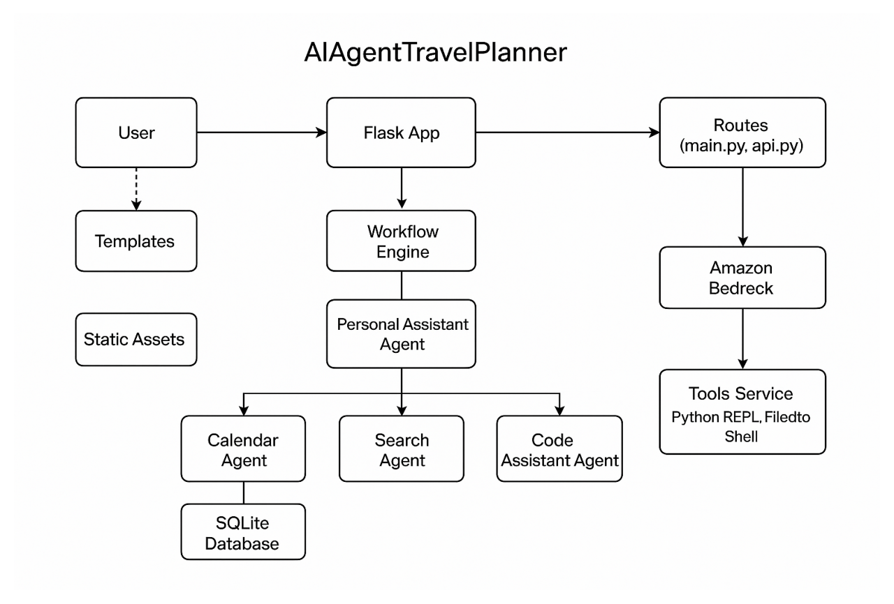

# AIAgentTravelPlanner Architecture

## 1. User & UI Layer
The end user interacts via a web browser:
- Served by **Flask** using HTML templates (`templates/`) and static assets (`static/`).

## 2. Flask Application & Routing
- **app.py** initializes the Flask app.
- **main.py** and **api.py** define REST endpoints:
  - `/chat` for user-agent messages
  - `/workflow/status` for tracking progress
  - `/health` for service checks

## 3. Workflow Engine
Implemented in `graph/workflow.py`:
- Orchestrates multi-agent conversations
- Maintains conversation state
- Dispatches messages to appropriate agents

## 4. Personal Assistant Agent
Central coordinator:
- Parses user intents
- Delegates tasks to specialized agents
- Aggregates responses into coherent replies

## 5. Specialized Agents
- **Calendar Agent**
  - Manages event scheduling, conflict resolution
  - Persists events in **SQLite** via SQLAlchemy models (`models.py`)

- **Search Agent**
  - Integrates with **Perplexity** for real-time web searches
  - Aggregates and ranks external sources

- **Code Assistant Agent**
  - Uses **Tools Service** for:
    - Python REPL
    - File editing
    - Shell execution

## 6. Service Layer
- **Amazon Bedrock**
  - Provides LLM inference for all agents

- **Perplexity Service**
  - Real-time search API for research queries

- **Tools Service**
  - Secure execution environment for code snippets and shell commands

## 7. Data Persistence
- **SQLite Database**:
  - Stores calendar events, chat sessions, message history, and agent states
  - Defined through SQLAlchemy models in `models.py`

---

This modular architecture ensures:
- **Separation of concerns**: Each agent focuses on a distinct domain
- **Scalability**: Agents and services can be scaled independently
- **Secure integrations**: External services are isolated through dedicated service layers
